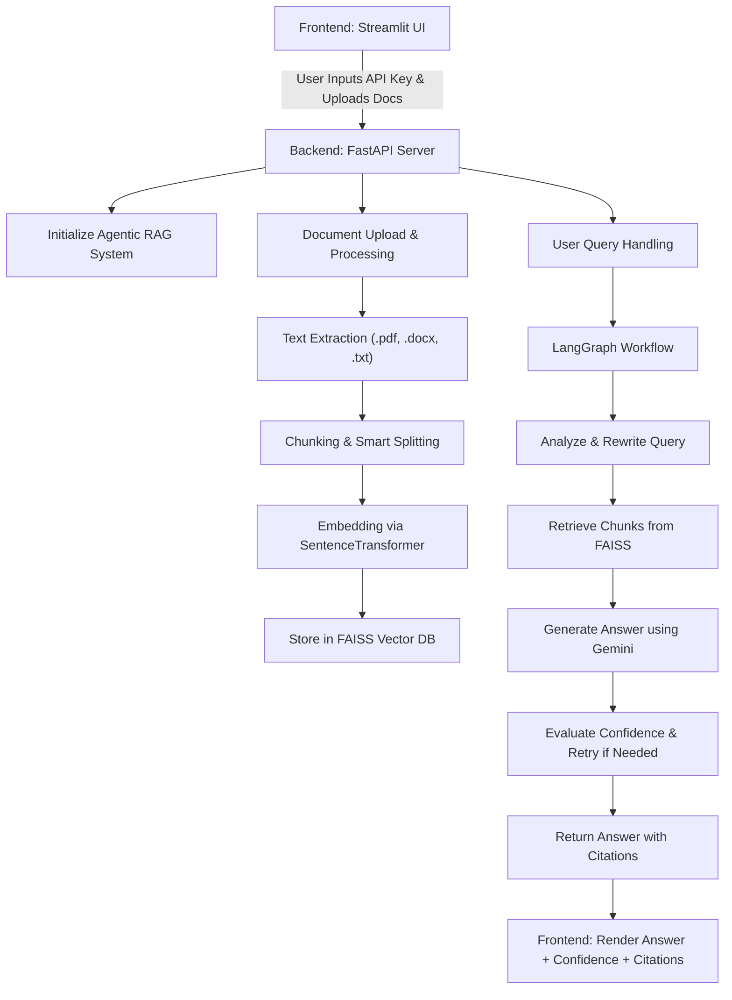

# 🤖 Agentic RAG Assistant

An intelligent document analysis system with **self-healing retrieval** and **adaptive learning**, powered by **Gemini 1.5 Flash**, **LangGraph**, **FAISS**, and **Streamlit**.

---

## 🔄 Architecture Flowchart



---

## 🚀 Features

* Upload `.pdf`, `.docx`, `.txt` files
* Chunk + Embed content with semantic chunking
* FAISS-based retrieval
* Gemini 1.5 Flash powered RAG
* Confidence evaluation + retry logic (self-healing)
* Streamlit UI with confidence, citations, and chat history

---

## ⚙️ Tech Stack

| Layer     | Technology                   |
| --------- | ---------------------------- |
| Frontend  | Streamlit + HTML/CSS         |
| Backend   | FastAPI                      |
| AI Model  | Gemini 1.5 Flash (via API)   |
| Workflow  | LangGraph                    |
| Embedding | SentenceTransformer (MiniLM) |
| DB        | FAISS Vector Store           |

---

## 📁 Setup Instructions

### 1. Clone the Repository

```bash
git clone <your-repo-url>
cd <your-repo-folder>
```

### 2. Create Virtual Environment

```bash
python -m venv venv
source venv/bin/activate  # For Linux/macOS
venv\Scripts\activate     # For Windows
```

### 3. Install Dependencies

```bash
pip install -r requirements.txt
```

### 4. Set Environment Variable

Create a `.env` file or set manually:

```env
GOOGLE_API_KEY=your_gemini_api_key_here
```

### 5. Start Backend (FastAPI)

```bash
uvicorn backend:app --reload
```

### 6. Start Frontend (Streamlit)

```bash
streamlit run frontend.py
```

---

## 🤝 How to Use

1. Enter your **Google Gemini API key** in the sidebar
2. Upload `.pdf`, `.docx`, or `.txt` files
3. Click **"Process Documents"**
4. Ask questions using the input box
5. View confidence, response time, citations, and conversation history

---

## 📄 Requirements

Add the following to `requirements.txt`:

```txt
fastapi
uvicorn
streamlit
python-dotenv
sentence-transformers
PyPDF2
python-docx
langgraph
google-generativeai
faiss-cpu
```

---

## 🚫 Limitations

* Local-only backend (ensure port `8000` is open)
* Gemini API usage may be rate-limited
* No persistent vector DB (in-memory FAISS)

---

## 🚀 Future Enhancements

* MongoDB / SQLite for persistent memory
* HuggingFace / OpenAI fallback
* Admin analytics dashboard
* Login/authentication

---

## 🙌 Credits

Built by \[Shriram Prabhu J] with ❤️ using Gemini, LangGraph & Streamlit.

---

## 🔧 Sample `.env`

```env
GOOGLE_API_KEY=AIza....your_key...
```

---
